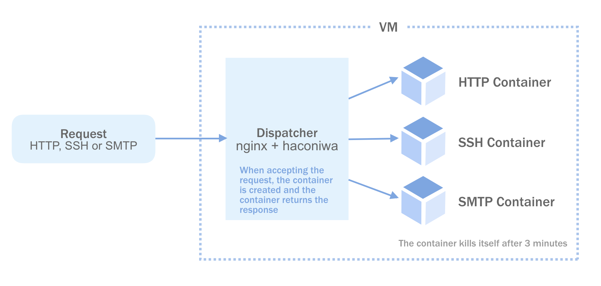
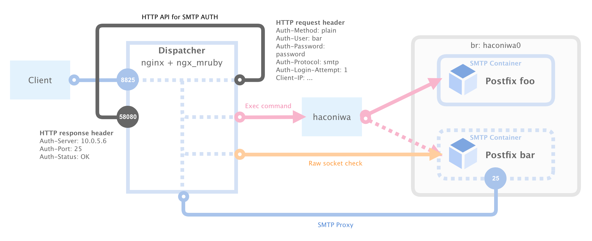

FastContainer: Nginx with Haconiwa
==

This is an example of [FastContainer][fastcontainer] implementation by [nginx][nginx], [ngx_mruby][ngx_mruby] and [haconiwa][haconiwa].

[fastcontainer]: https://speakerdeck.com/matsumoto_r/fastcontainer-at-iot38
[nginx]: https://github.com/nginx/nginx
[ngx_mruby]: https://github.com/matsumotory/ngx_mruby
[haconiwa]: https://github.com/haconiwa/haconiwa



Requirement
--

- docker >= 18.06.0-ce
- vagrant >= 2.1.1

Usage
--

To create an image to use in this implementation, run GNU make and vagrant to run the VM on the Virtualbox.

```sh
# Create nginx and container images to `./provision/dist`
$ make

# Create instance, and provision by `./provision/provisioner.sh`
$ vagrant up
```

When the VM starts up, let's start the container with the request trigger in the following way.

### HTTP

HTTP container starts

```sh
$ curl http://127.0.0.1:8080/

# HTTP foo container responds
$ curl -I 'Host: foo.test' http://127.0.0.1:8080/

# HTTP bar container responds
$ curl -I 'Host: bar.test' http://127.0.0.1:8080/
```

### SSH

SSH container starts

```sh
$ ssh root@127.0.0.1 -p 8022
# => password: screencast
```

### SMTP

SMTP container starts

```sh
$ telnet 127.0.0.1 8025

$ printf "%s\0%s\0%s" foo foo password | openssl base64 -e
YmFyAGJhcgBwYXNzd29yZA==

$ telnet 127.0.0.1 8825
Trying 127.0.0.1...
Connected to localhost.
Escape character is '^]'.
220 ubuntu-xenial ESMTP ready
HELO local
250 ubuntu-xenial
AUTH PLAIN YmFyAGJhcgBwYXNzd29yZA==
235 2.0.0 OK
# SMTP foo container responds

$ printf "%s\0%s\0%s" foo foo password | openssl base64 -e
Zm9vAGZvbwBwYXNzd29yZA==
$ telnet 127.0.0.1 8825
Trying 127.0.0.1...
Connected to localhost.
Escape character is '^]'.
220 ubuntu-xenial ESMTP ready
HELO local
250 ubuntu-xenial
AUTH PLAIN Zm9vAGZvbwBwYXNzd29yZA==
235 2.0.0 OK
# SMTP bar container responds
```

Multitenancy
--

HTTP determines the domain from the request host and SMTP determines the domain from SMTP AUTH. Then, upstream containers are dynamically selected from the discrimination.



SMTP AUTH uses [ngx_mail_core_module](http://nginx.org/en/docs/mail/ngx_mail_core_module.html).

Todo
--

- [x] Multitenancy
- [ ] Auto Scaling
- [ ] Multi Host

Author
--

- [linyows][linyows]

[linyows]: https://github.com/linyows

License
--

This project is under the MIT License.

- nginx: https://github.com/nginx/nginx/blob/master/docs/text/LICENSE
- ngx_mruby: https://github.com/matsumotory/ngx_mruby/blob/master/MITL
- haconiwa: https://github.com/haconiwa/haconiwa/blob/master/LICENSE
